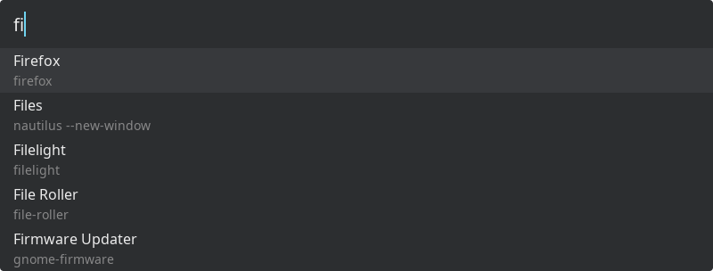

# BNK Launch

[](https://github.com/borgenk/bnklaunch/actions/workflows/ci.yml)
[](https://github.com/borgenk/bnklaunch/releases/latest)

A minimal Wayland application launcher written in Rust.



_Disclaimer: learning project, non-standard Rust, built mainly for my own use, AI-assisted._

## Requirements

- A Linux desktop running a **Wayland** session
- A compositor that supports **zwlr_layer_shell_v1**
- The libxkbcommon and freetype libraries
- A some what new kernel for uring and probably a few other things I havent checked

## Install

```sh
curl -fsSL https://raw.githubusercontent.com/borgenk/bnklaunch/main/install.sh | sh
```

This drops the binary in `~/.local/bin`. bnklaunch has no desktop entry: bind it to a
compositor hotkey instead.
